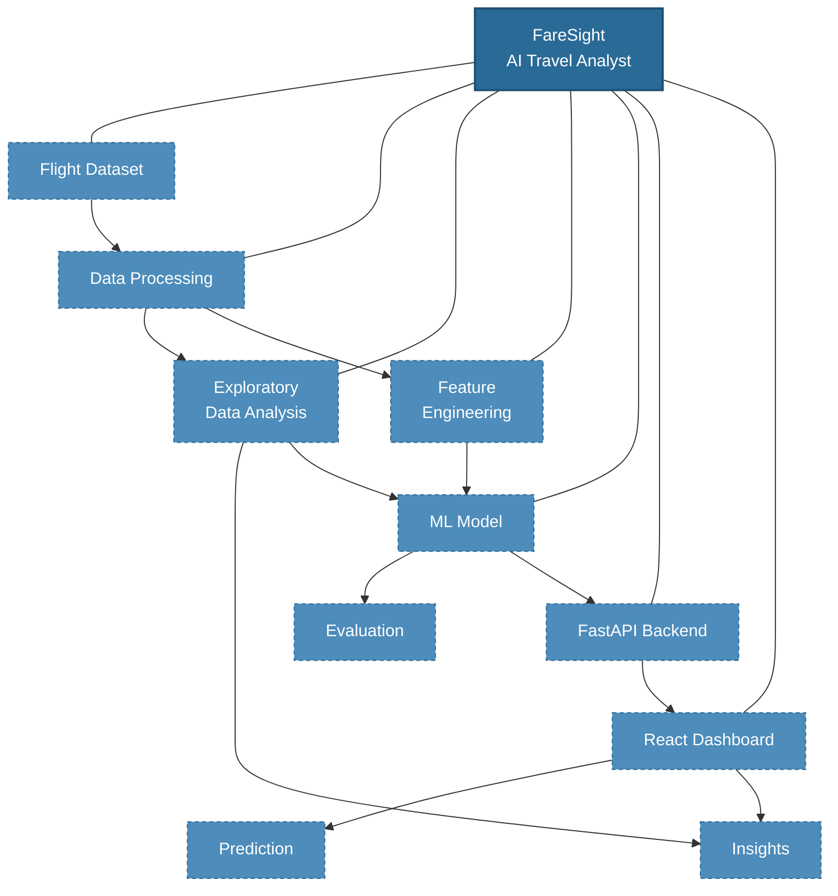
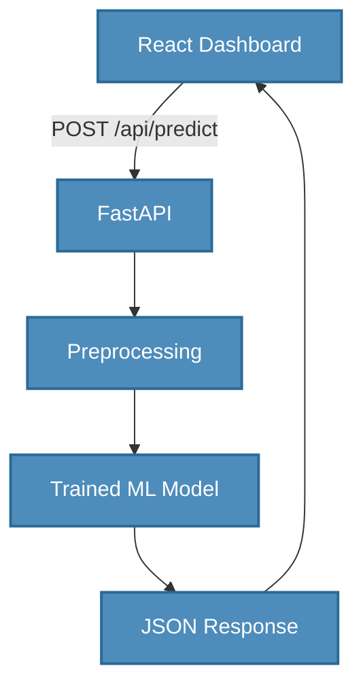

<h1 align="center">FareSight - AI Travel Analyst</h1>

<p align="center"><strong>Explore flight prices. Understand the factors. Predict smarter fares.</strong></p>

---

> 🚧 **Status: In Development**
>
> FareSight is being built incrementally, starting with data exploration and machine-learning foundations before completing the full interactive dashboard. The repository currently contains only the project scaffold (`.gitignore`); no source code, notebooks, or trained models have been committed yet. Everything marked **Planned** below describes the target design, not current functionality.

---

## 📌 Project Overview

FareSight is an end-to-end flight-price intelligence system. It combines **exploratory data analysis (EDA)**, **machine-learning-based price prediction**, and a **FastAPI + React dashboard** to answer one practical question:

> **What drives flight prices, and can we predict them before booking?**


## Problem Statement

Flight prices are volatile, opaque, and influenced by many interacting factors - airline, route, number of stops, duration, departure time, season, and more. Travellers rarely know whether the fare they see is reasonable, and understanding *why* a price is high is even harder.

FareSight addresses this by:

1. Cleaning and exploring a flight-price dataset to surface the major price drivers.
2. Building a regression model that estimates flight prices from flight characteristics.
3. Exposing the model through a clean API and dashboard so insights and predictions are actually usable.

## Objectives

- **Explore** - Preprocess the flight-price dataset and produce at least 5 meaningful visualizations.
- **Understand** - Identify the major factors affecting flight prices and translate them into actionable insights.
- **Model** - Engineer features and train a regression model to predict flight prices.
- **Evaluate** - Report model performance transparently (MAE, RMSE, R²) and explain which features drive predictions.
- **Deliver** - Package the analysis and model behind a FastAPI backend with a React dashboard.

## Challenge Scope

| Part | Focus | Status |
| ---- | ----- | ------ |
| Part 1 | Exploration - cleaning, ≥5 visualizations, price-factor analysis, insights | **Planned** |
| Part 2 | Modeling - feature engineering, training, evaluation, feature explanation | **Planned** |
| Part 3 | Optional stretch - cheapest booking time, price forecasting, recommendation system | **Not started** |


## Key Features

| Feature | Description | Status |
| ------- | ----------- | ------ |
| Dataset cleaning & preprocessing | Missing values, duplicates, data-type and date/time handling | **Planned** |
| Exploratory data analysis | ≥5 visualizations: price distribution, airline, stops, duration, routes, time | **Planned** |
| Price-factor insights | Data-driven explanation of what drives flight prices | **Planned** |
| Feature engineering | Encoding, time-based features, derived duration/route features | **Planned** |
| Price prediction model | Regression models trained and evaluated on the dataset | **Planned** |
| Model evaluation & explanation | MAE / RMSE / R² reporting and feature-importance analysis | **Planned** |
| FastAPI backend | REST API serving overview, analysis, and prediction endpoints | **Planned** |
| React dashboard | Interactive overview, charts, insights, and prediction UI | **Planned** |

## System Architecture

FareSight is designed as a **hub-and-spoke system**: every component feeds into or reads from the core application, while the data still flows naturally from dataset → processing → model → API → dashboard.



> **Note:** The dashed nodes represent the *target* architecture. No component has been implemented in the repository yet.

## Project Workflow

The intended end-to-end pipeline:


**Current status:** the pipeline is at the very first stage — the repository scaffold is in place and the dataset pipeline has not been built yet.

## Tech Stack

> All technologies below are part of the **planned** stack. They will be listed as implemented only once the corresponding code exists in the repository.

| Layer | Technology | Purpose |
| ----- | ---------- | ------- |
| Frontend | React + Vite | Component-based dashboard UI |
| Frontend | Tailwind CSS | Styling and responsive layout |
| Frontend | Recharts | Interactive price visualizations |
| Frontend | Axios | HTTP communication with the backend |
| Backend | Python + FastAPI | REST API serving data and predictions |
| Backend | Pydantic | Request/response validation |
| Data Science | Pandas, NumPy | Data cleaning and manipulation |
| Data Science | Scikit-learn | Feature engineering and regression models |
| Data Science | Matplotlib, Seaborn | Visualizations |
| Data Science | Joblib | Model persistence |

## Project Structure

The target repository layout (to be created in upcoming milestones):

```text
FareSight/
├── backend/                  # FastAPI application — Planned
│   ├── app/
│   │   ├── main.py           # App entry point
│   │   ├── models.py         # Pydantic schemas
│   │   └── routers/          # API route handlers
│   ├── requirements.txt
│   └── model/                # Trained model artifacts (.joblib / .pkl)
├── frontend/                 # React + Vite dashboard — Planned
│   ├── src/
│   │   ├── components/
│   │   ├── pages/
│   │   └── api/
│   └── package.json
├── notebooks/                # EDA & modeling notebooks — Planned
├── data/                     # Flight-price datasets (git-ignored)
├── models/                   # Serialized models (git-ignored)
└── README.md
```

## Data Science Pipeline

### Data Cleaning

The planned cleaning stage will cover:

- **Missing-value handling** — detection and a documented imputation/dropping strategy.
- **Duplicate detection** — removing or flagging duplicate records.
- **Data-type conversion** — numeric, categorical, and datetime fields cast correctly.
- **Date/time processing** — extraction of month, day, weekday, and season features.
- **Duration processing** — parsing and normalizing flight-duration fields.
- **Categorical-value consistency** — standardizing airline, city, and route labels.
- **Outlier investigation** — identifying extreme fares and deciding how to treat them.

These operations will be implemented and documented as the notebooks are added.

### Exploratory Data Analysis

The planned EDA includes the analyses required by the challenge (≥5 meaningful visualizations):

- Flight **price distribution**
- **Price by airline**
- **Price vs number of stops**
- **Price vs duration**
- **Price by source / destination** (route analysis)
- **Time-based price analysis** (month, weekday, season)
- **Correlation analysis** between numeric features and price

Visualizations will be generated with Matplotlib and Seaborn and exported from the notebooks. Findings and recommendations will be added here once the analysis is complete.

### Feature Engineering

Planned features include:

- Categorical encoding for airline, source, destination, and route.
- Derived features such as flight duration in minutes and number of stops.
- Time-based features (departure hour, month, weekday, season).
- Any engineered interaction features that the EDA suggests are relevant.

## Machine Learning

FareSight approaches flight-price prediction as a **supervised regression problem**: given flight characteristics, predict the price.

### Planned Models

- **Linear Regression** — a simple, interpretable baseline.
- **Decision Tree Regressor** — captures non-linear price relationships.
- **Random Forest Regressor** — an ensemble expected to give the strongest baseline performance.

### Planned Evaluation

Models will be evaluated on a held-out test split using:

- **MAE** — mean absolute error (interpretable in currency terms).
- **RMSE** — root mean squared error (penalizes large errors).
- **R²** — proportion of variance explained.

**Model interpretability:** feature-importance analysis will be used to explain which factors (e.g., number of stops, duration, airline, route) drive predictions most strongly.

> **Status:** no model has been trained yet, and no performance numbers exist in the repository. Metrics will be reported here after training and evaluation.

## Backend Architecture

### Planned Request Flow



### Planned API Endpoints

| Method | Endpoint | Purpose |
| ------ | -------- | ------- |
| GET | `/api/overview` | Dataset statistics and summary metrics |
| GET | `/api/analysis` | Aggregated EDA results and insights |
| POST | `/api/predict` | Return a predicted price for given flight characteristics |

> **Status:** the backend does not exist yet; these endpoints are part of the planned design.

## Frontend Dashboard

### Planned Sections

- **Overview** — dataset statistics: average price, min/max price, airline and route stats.
- **Price Analysis** — interactive charts (Recharts) with filters for airline, route, and stops.
- **Insights** — key findings surfaced from the EDA stage.
- **Price Prediction** — a form where users enter flight characteristics and receive an estimated price from the model.
- **Model** — performance metrics and feature-importance visualization.

> **Status:** the frontend does not exist yet; these sections are part of the planned design.

## Installation

The repository is currently scaffold-only, so there is no runnable application code to install yet. The following commands describe the **planned** setup and will apply once the `backend/` and `frontend/` directories are added.

### Planned — Backend (Python)

```bash
python -m venv .venv
```

Windows activation:

```powershell
.venv\Scripts\Activate.ps1
```

Then:

```bash
pip install -r backend/requirements.txt
```

### Planned — Frontend (React + Vite)

```bash
cd frontend
npm install
npm run dev
```

## Usage

Once implemented, the intended usage flow is:

1. Run the FastAPI backend (serves the API and model predictions).
2. Start the Vite dev server for the React dashboard.
3. Open the dashboard to explore the visualizations, review insights, and test price predictions.

Detailed run instructions will be added as the components are built.

## API Overview

The planned API contract is summarized below and will be documented in full once the backend is implemented.

| Method | Endpoint | Request | Response |
| ------ | -------- | ------- | -------- |
| GET | `/api/overview` | — | Dataset summary (row count, average/min/max price, top airlines/routes) |
| GET | `/api/analysis` | — | Aggregated EDA results and key insights |
| POST | `/api/predict` | Flight features (JSON) | Predicted price (JSON) |

> **Status:** all endpoints are **planned** — none are live yet.

## Results

> Results will be updated after the data preprocessing, model training, and evaluation stages are completed.

| Model | MAE | RMSE | R² |
| ----------------- | --: | ---: | -: |
| Linear Regression |  —  |  —   | —  |
| Decision Tree     |  —  |  —   | —  |
| Random Forest     |  —  |  —   | —  |

No performance numbers are reported yet because no model has been trained.

## Challenges

- **Data quality** — real-world flight-price data often contains missing values, inconsistent categories, and outliers that require careful handling.
- **Price volatility** — flight prices depend on booking timing and demand, which are hard to capture fully in a static dataset.
- **Feature design** — extracting useful time-based and route-based features is key to model quality.
- **Model generalization** — a simple baseline may underfit; the ensemble approach should balance interpretability with performance.
- **Integration** — wiring the trained model, FastAPI, and React dashboard into one smooth flow requires careful contract design (request/response schemas).

## Future Improvements

- **Part 3 stretch goals** (optional):
  - Cheapest booking-time analysis.
  - Flight-price forecasting over time.
  - Flight recommendation system.
- Hyperparameter tuning and cross-validation for the final model.
- Additional model variants (e.g., gradient boosting) for comparison.
- Deployment of the backend and dashboard to a public URL.
- Screenshots and a short demo walkthrough in this README.


