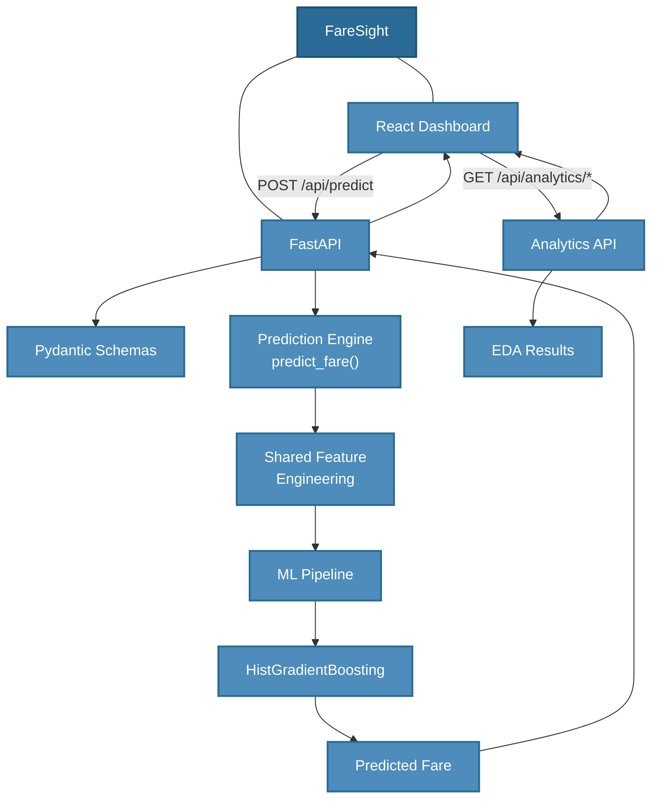

<h1 align="center">FareSight - Travel Analyst</h1>

<p align="center"><strong>Explore flight fares. Understand the drivers. Predict smarter prices.</strong></p>

<p align="center">
  
  
  
  
  
</p>

> **Status: Complete** — end-to-end ML project: data pipeline → EDA → model experiments → REST API → React dashboard.

---

## Overview

FareSight is a full-stack AI travel-fare analyst. It cleans and explores a
100,000-row flight-pricing dataset, trains regression models to predict fares,
and exposes the result through a **FastAPI** backend and a **React** dashboard.

The project answers one practical question:

> **What drives flight fares, and can we predict them before booking?**

Built for the **MIC AIML Department Recruitment Challenge** (Data Science &
Visualization track), FareSight demonstrates the complete ML lifecycle —
preprocessing, EDA, feature engineering, model comparison, hyperparameter
tuning, model selection, a prediction REST API, and a production-style
frontend.

## Why this project exists

Flight fares are volatile, opaque, and driven by many interacting factors —
airline, route, stops, duration, travel class, booking lead time, and season.
Travellers rarely know whether the fare they see is reasonable. FareSight
turns a messy pricing dataset into:

1. **Understanding** — which factors most strongly relate to fare.
2. **Prediction** — a trained model that estimates a fare from raw flight details.
3. **Usability** — a clean API and dashboard so the analysis is actually usable.

## Features

| Area | Feature |
| ---- | ------- |
| Data | Cleaning pipeline (duplicates, types, dates, times, durations, outliers) |
| EDA | 11 visualizations covering price distribution, airlines, classes, stops, seasons, channels, sources, correlation |
| ML | Model comparison (Linear Regression, Random Forest, HistGradientBoosting) + hyperparameter tuning |
| Prediction | Shared feature engineering + trained HistGradientBoosting model (`predict_fare`) |
| API | FastAPI with typed Pydantic schemas, validation, CORS, `/docs` and `/redoc` |
| Analytics API | Precomputed aggregates from the verified EDA results |
| Frontend | React + Vite + Tailwind dashboard with live prediction and analytics |
| Integration | Live API health indicator, real prediction flow, loading/error/empty states |

## Architecture

FareSight is a hub-and-spoke system: the ML pipeline is the core, the FastAPI
backend serves it, and the React dashboard consumes it.



## Dataset

| Property | Value |
| -------- | ----- |
| File | `data/flight_pricing_dataset.csv` |
| Rows (raw) | 100,000 |
| Columns | 18 |
| Rows (after dedup) | 98,039 |
| Processed file | `data/processed/flight_prices_clean.csv` |
| Target | `Price` (₹, INR) |

Fields: `Airline`, `Source`, `Destination`, `Departure_Date`, `Departure_Time`,
`Arrival_Time`, `Duration`, `Total_Stops`, `Distance_km`, `Travel_Class`,
`Days_Before_Departure`, `Season`, `Weekday`, `Aircraft_Type`,
`Booking_Channel`, `Passenger_Count`, `Price`.

## Data Preprocessing

`backend/app/data/preprocessor.py` runs the full cleaning pipeline:

- **Duplicate removal** — 100,000 → 98,039 rows.
- **String normalization** — airline names, city aliases (IATA ↔ city name).
- **Date parsing** — derives year, month, day, day-of-week from `Departure_Date`.
- **Time parsing** — mixed 12h/24h formats → `Departure_Hour`, `Arrival_Hour`.
- **Duration parsing** — `"2h 15m"`, `"177 min"`, and decimal hours → minutes.
- **Stops normalization** — `"non-stop"` / `"1 stop"` / `"2 stops"` → integers.
- **Price cleaning** — `"Rs. 5,181.56"` → numeric.
- **Passenger counts** — word forms (`"two"`) → integers.
- **Missing values** — categoricals filled with `Unknown`; numerics imputed in the pipeline.
- **Validation** — negative prices/durations/distances rejected.

## Exploratory Data Analysis

`backend/app/analysis/eda.py` produces 11 plots in `outputs/plots/`:

| # | Plot | File |
| - | ---- | ---- |
| 1 | Flight price distribution | `01_price_distribution.png` |
| 2 | Average price by airline | `02_price_by_airline.png` |
| 3 | Price by travel class | `03_price_by_travel_class.png` |
| 4 | Price by stops | `04_price_by_stops.png` |
| 5 | Price vs duration | `05_price_vs_duration.png` |
| 6 | Price by booking channel | `06_price_by_booking_channel.png` |
| 7 | Price by source | `07_price_by_source.png` |
| 8 | Price by season | `08_price_by_season.png` |
| 9 | Price vs days before departure | `09_price_vs_days_before_departure.png` |
| 10 | Correlation matrix | `10_correlation_matrix.png` |
| 11 | Feature importance | `11_feature_importance.png` |

Key verified findings:

- **Travel class** strongly relates to fare: Economy ₹59,668 → First ₹133,873.
- **Distance and duration** are near-identical (Pearson ≈ 0.99) and are the strongest predictors.
- **Stops** raise average fare: ₹61,603 (0 stops) → ₹84,661 (2 stops).
- **Booking channel** differences are small (< ₹1,200 across channels).
- **Seasonal** differences are real but modest (Summer ₹77,101 vs Monsoon ₹69,252).
- **Booking lead time** has a weak negative relationship with fare.

## Feature Engineering

`backend/app/models/feature_engineering.py` provides the single shared
`engineer_features()` used by both **training and prediction**:

- Numerical: `Total_Stops`, `Distance_km`, `Days_Before_Departure`,
  `Passenger_Count`, `Departure_Year`, `Departure_Month`, `Departure_Day`,
  `Departure_DayOfWeek`, `Departure_Hour`, `Arrival_Hour`, `Duration_Minutes`.
- Categorical: `Airline`, `Source`, `Destination`, `Travel_Class`, `Season`,
  `Weekday`, `Aircraft_Type`, `Booking_Channel`.

A `ColumnTransformer` pipeline applies median imputation to numerics and
most-frequent imputation + one-hot encoding to categoricals.

## Model Experiments

`docs/experiments/experiment_log.md` documents the full comparison:

| Experiment | Model | Key change | MAE | RMSE | R² | Decision |
| --- | --- | --- | ---: | ---: | ---: | --- |
| Baseline | Linear Regression | — | ₹23,097.40 | ₹45,456.32 | 0.6238 | Baseline |
| Baseline | Random Forest | — | ₹15,394.65 | ₹42,214.69 | 0.6756 | Current best |
| Feature selection | Random Forest | Distance + Duration | ₹15,394.65 | ₹42,214.69 | 0.6756 | Keep both |
| Feature selection | Random Forest | Distance only | ₹15,667.57 | ₹42,169.56 | 0.6763 | Reject |
| Feature selection | Random Forest | Duration only | ₹16,091.45 | ₹42,789.61 | 0.6667 | Reject |
| Tuning | HistGradientBoosting | Defaults | ₹13,998.13 | ₹40,133.49 | 0.7068 | Tune further |
| **Final** | **HistGradientBoosting** | **Tuned** | **₹13,851.14** | **₹40,048.69** | **0.7080** | **Selected** |

**Final model configuration** (`HistGradientBoostingRegressor`):

- `learning_rate = 0.05`
- `max_iter = 400`
- `max_leaf_nodes = 63`
- `l2_regularization = 1.0`
- `random_state = 42`

**Artifacts:** `models/faresight_model.joblib` + `models/faresight_model_metadata.json`.

## Prediction Engine

`backend/app/prediction/predictor.py` loads the model **once** at import time
and exposes `predict_fare(...)`. Raw inputs are converted into the engineered
feature space via the shared `engineer_features()` — no logic duplication.

```text
Raw flight details
        ↓
engineer_features()
        ↓
Trained model pipeline
        ↓
Predicted fare (₹)
```

Verified prediction outputs (from `test_predictor.py`):

| Scenario | Predicted fare |
| -------- | -------------: |
| Economy / direct | ₹8,626.44 |
| Business class | ₹13,674.94 |
| Multiple stops | ₹5,521.87 |
| International | ₹24,867.55 |

## FastAPI Backend

`backend/app/main.py` wires the app with CORS, OpenAPI metadata, and route
registration. The model is loaded once at startup — not per request.

### Endpoints

| Method | Endpoint | Purpose |
| ------ | -------- | ------- |
| GET | `/` | Welcome message |
| GET | `/api/health` | Health check (also used by the dashboard indicator) |
| POST | `/api/predict` | Predict fare from raw flight details |
| GET | `/api/analytics/summary` | Dataset summary statistics |
| GET | `/api/analytics/airlines` | Average fare by airline |
| GET | `/api/analytics/classes` | Average fare by travel class |
| GET | `/api/analytics/stops` | Average fare by stops |
| GET | `/api/analytics/seasons` | Average fare by season |
| GET | `/api/analytics/sources` | Average fare by source city |
| GET | `/api/analytics/destinations` | Average fare by destination city |
| GET | `/api/analytics/booking-channels` | Average fare by booking channel |
| GET | `/api/analytics/duration` | Fare-vs-duration scatter + correlation |
| GET | `/api/analytics/days-before-departure` | Fare-vs-lead-time scatter + correlation |
| GET | `/api/analytics/feature-importance` | Model feature importance |

Interactive docs at `/docs` (Swagger) and `/redoc`.

### Example request

```bash
curl -X POST http://localhost:8000/api/predict \
  -H "Content-Type: application/json" \
  -d '{
    "airline": "Indigo",
    "source": "Delhi",
    "destination": "Mumbai",
    "departure_date": "2026-09-15",
    "departure_time": "10:30 AM",
    "arrival_time": "12:45 PM",
    "duration": "2h 15m",
    "total_stops": 0,
    "distance_km": 1150,
    "travel_class": "Economy",
    "days_before_departure": 30,
    "season": "Monsoon",
    "weekday": "Tuesday",
    "aircraft_type": "Airbus A320",
    "booking_channel": "Website",
    "passenger_count": 1
  }'
```

### Example response

```json
{
  "predicted_price": 8626.44,
  "currency": "INR"
}
```

### Validation & error handling

Pydantic schemas enforce required fields, numeric ranges (distance > 0,
passenger count 1–9, stops 0–10, lead time ≥ 0), date format
(`YYYY-MM-DD`), and source ≠ destination. Invalid requests return clean
`422` responses with field-level messages — no stack traces.

## React Dashboard

`frontend/` — Vite + React + TypeScript + Tailwind CSS + Recharts + Axios.

| Page | Contents |
| ---- | -------- |
| Dashboard | KPI cards (avg/min/max fare, flights analyzed) + fare-by-airline / class / stops charts |
| Analytics | Fare by season, channel, source, destination + fare-vs-duration and fare-vs-lead-time scatter plots |
| Prediction | Full flight form (date/time pickers, selects, numeric inputs) → live fare estimate |
| Insights | Model feature importance chart + model comparison table + EDA findings |

The header shows a live **API Online / Offline** indicator via
`GET /api/health`. Every API-backed view implements loading, error, and empty
states, and the layout is responsive (sidebar drawer on mobile).

The prediction form sends **raw flight fields** — the backend derives
engineered features, mirroring the training pipeline exactly.

## API Service Layer

All HTTP lives in `frontend/src/services/api.ts` — components never call
Axios directly. `VITE_API_BASE_URL` (see `frontend/.env.example`) points at
the backend; it defaults to `http://localhost:8000`.

## Project Structure

```text
FareSight/
├── backend/
│   └── app/
│       ├── main.py                 # FastAPI app, CORS, docs
│       ├── api/routes.py           # API routes
│       ├── schemas/prediction.py   # Pydantic schemas
│       ├── prediction/
│       │   ├── predictor.py        # predict_fare() — model loaded once
│       │   └── test_predictor.py   # Verified prediction tests
│       ├── models/
│       │   ├── feature_engineering.py
│       │   ├── train.py
│       │   ├── train_final.py
│       │   ├── tune_gradient_boosting.py
│       │   └── feature_selection.py
│       ├── data/                   # preprocessing pipeline
│       └── analysis/               # EDA, feature importance, analytics
├── frontend/
│   ├── src/
│   │   ├── pages/                  # Dashboard, Analytics, Prediction, Insights
│   │   ├── components/             # layout, cards, charts, forms, common
│   │   ├── services/api.ts         # Axios layer
│   │   ├── hooks/                  # useAsyncData, useApiHealth
│   │   ├── types/                  # API types + form options
│   │   └── utils/                  # formatting helpers
│   ├── .env.example
│   └── package.json
├── data/
│   ├── flight_pricing_dataset.csv
│   └── processed/flight_prices_clean.csv
├── models/
│   ├── faresight_model.joblib
│   └── faresight_model_metadata.json
├── outputs/plots/                  # EDA visualizations
├── docs/experiments/               # experiment logs
└── README.md
```

## Installation

### Backend

```bash
python -m venv .venv
```

Windows activation:

```powershell
.\.venv\Scripts\Activate.ps1
```

Then:

```bash
pip install -r backend/requirements.txt
```

### Frontend

```bash
cd frontend
npm install
```

### Environment variables

Copy `frontend/.env.example` to `frontend/.env.local` and adjust if needed:

```env
VITE_API_BASE_URL=http://localhost:8000
```

No secrets are committed.

## Running locally

```bash
# Terminal 1 — backend
cd backend
uvicorn app.main:app --reload --port 8000

# Terminal 2 — frontend
cd frontend
npm run dev
```

Open <http://localhost:5173> (dashboard) and <http://localhost:8000/docs>
(API docs).

## Testing

- **Backend:** `python backend/app/prediction/test_predictor.py` — verifies
  the four documented prediction scenarios (all pass).
- **API:** every endpoint was exercised with `curl` (root, health, prediction,
  all 10 analytics endpoints) plus invalid-input cases (negative distance,
  zero passengers, same source/destination, malformed date) — all return clean
  errors.
- **Frontend:** `npm run build` passes type checking and the production
  build; dev-server route checks return 200 for all pages.

## Limitations

- Fare predictions are **ML estimates** — actual fares vary with demand,
  promotions, and booking dynamics not present in a static dataset.
- The model explains ~71% of fare variance (R² 0.708); the residual error is
  meaningful for price-sensitive decisions.
- Analytics reflect the **historical dataset**, not live market data.
- Feature importance describes model weighting, not causal effect.

## Future improvements

- Deploy the FastAPI backend and dashboard (e.g., Railway / Vercel).
- Add live-demand features (day-of-week booking curves, competitor fares).
- Forecasting and cheapest-booking-time analysis (Part 3 stretch goals).
- Model monitoring and periodic retraining on fresh data.

## Recruitment challenge context

Developed for the **MIC AIML Department Recruitment Challenge — Data Science &
Visualization (AI Travel Analyst)** track:

- **Part 1 — Exploration:** cleaning, 11 visualizations, price-factor analysis, insights. ✅
- **Part 2 — Modeling:** feature engineering, model comparison, tuning, final model, evaluation. ✅
- **Part 3 — Stretch (optional):** cheapest booking time, forecasting, recommendation — **not implemented**.
